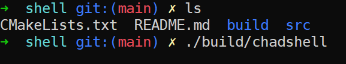
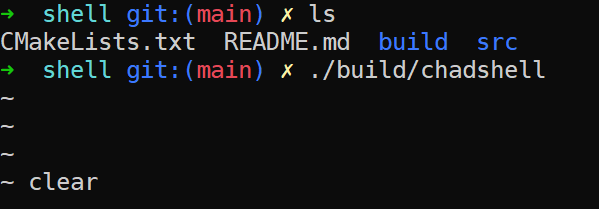
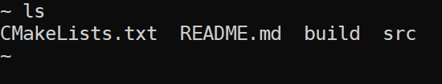
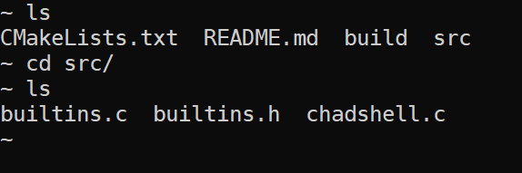
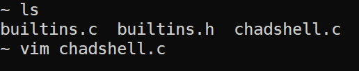
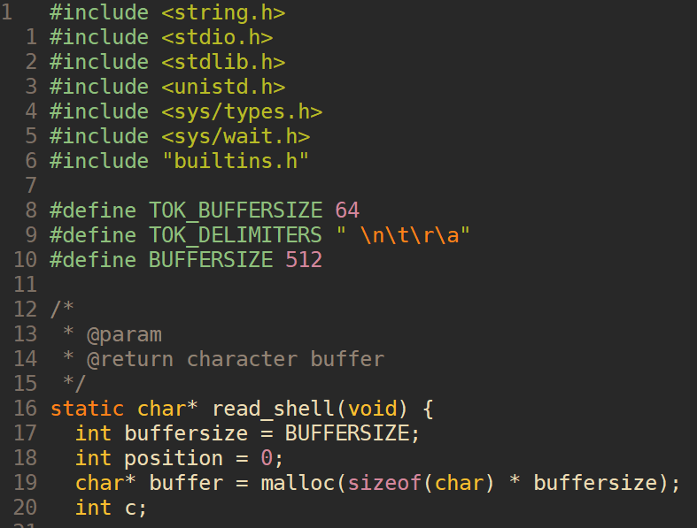
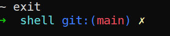

# Chad Shell

## Requirements
Uses POSIX standards so the <unistd.h> header is required. 

## Build
```bash
cmake -B build
cmake --build build
```

## Running 
```bash 
cd build/
./chadshell
```

## Example Use
### Running the shell
<div>
	
</div>

### Clearing and listing current directory
<div>
	
	
</div>

### Changing directory and opening text editor
<div>
	
	
	
</div>

### Exiting the shell
<div>
	
</div>
Note: can also just signal an interrupt or kill the process
